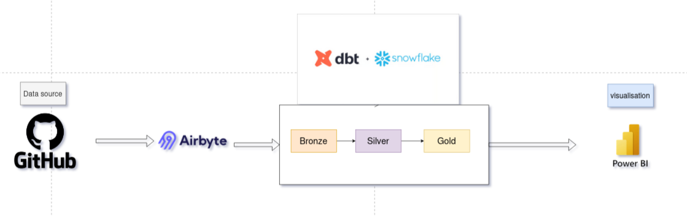
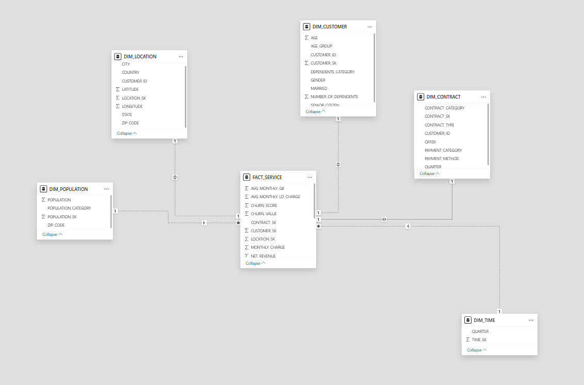
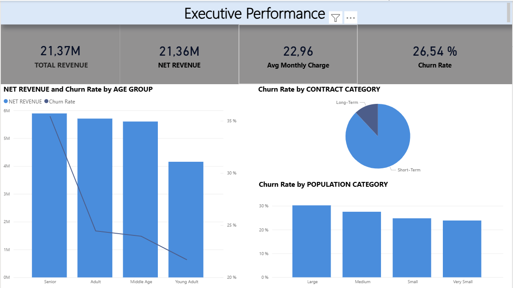
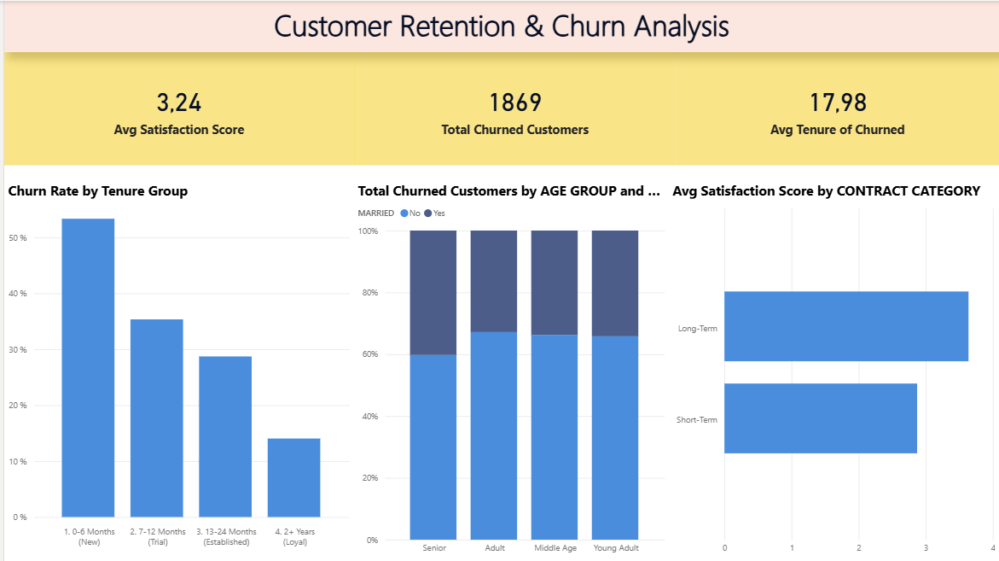
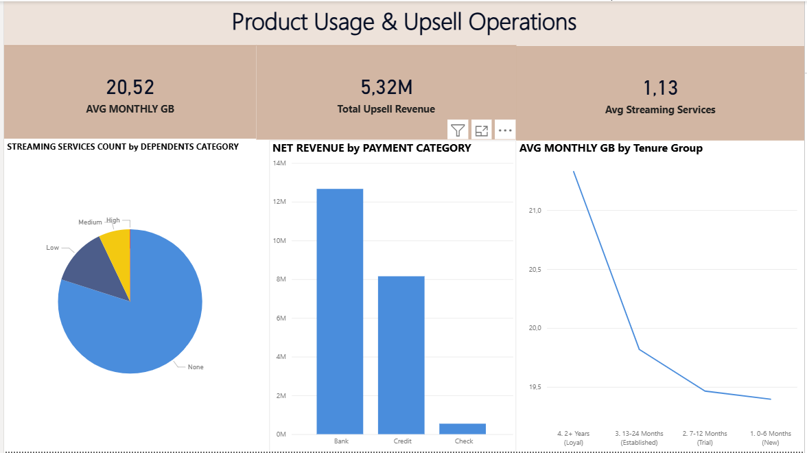

# 📊 End-to-End Analytics Pipeline: GitHub → Airbyte → Snowflake → dbt → Power BI

## 1. Overview

This project demonstrates a complete modern data engineering pipeline:

- Extract data from **GitHub** using **Airbyte**
- Land raw data in **Snowflake Bronze layer**
- Clean and transform data using **dbt** (Silver & Gold layers)
- Build dimensional models for analytics
- Visualize insights using **Power BI**

The goal is to move from raw operational data → to clean analytics-ready tables → to dashboards that support decision-making.

---

## 2. Project Architecture

### 📥 Data Flow (GitHub → Airbyte → Snowflake → dbt → Power BI)



**Explanation:**
1. Airbyte extracts data from GitHub  
2. Data lands in the **Bronze** layer in Snowflake  
3. dbt transforms it into **Silver** (clean data)  
4. dbt generates **Gold** tables (dimensions + fact tables)  
5. Power BI connects to the Gold layer for reporting  

---

## 3. Data Modeling (dbt Star Schema)

### 🏗️ Star Schema Diagram


The **Gold layer** contains the business-ready dimensional model:

- **Fact table**: `fact_service`
- **Dimensions**:  
  - `dim_customer`  
  - `dim_contract`  
  - `dim_location`  
  - `dim_population`  
  - `dim_time`

This schema enables efficient analytics and reporting.

---

## 4. dbt Project Structure

snowflake/
└── models/
├── Raw/
│ └── sources.yml
├── silver/
│ ├── demographics.sql
│ ├── location.sql
│ ├── population.sql
│ ├── service.sql
│ └── status.sql
└── gold/
├── dim_customer.sql
├── dim_contract.sql
├── dim_location.sql
├── dim_population.sql
├── dim_time.sql
├── fact_service.sql
└── schema.yml # tests for gold models


### ✔ Raw layer  
Contains external source definitions from Airbyte.

### ✔ Silver layer  
Applies cleaning, normalization, type casting, renaming, and basic joins.

### ✔ Gold layer  
Contains final analytics tables + tests (unique, not_null, relationships).

---

## 5. Power BI Dashboards

Below are the dashboards built using the **Gold** layer.

### 📊 Dashboard 1


### 📊 Dashboard 2


### 📊 Dashboard 3


---

## 6. Tools & Technologies

| Stage | Tool |
|-------|------|
| Data Extraction | Airbyte |
| Data Storage | Snowflake |
| Transformation | dbt |
| Orchestration | (Optional) Airbyte Scheduler |
| Visualization | Power BI |
| Version Control | GitHub |

---

## 7. How to Run This Project

### 1️⃣ Install dbt (Snowflake adapter)

```bash
pip install dbt-snowflake

2️⃣ Configure your Snowflake credentials

Use environment variables or a profiles.yml.
3️⃣ Run dbt

dbt deps
dbt seed
dbt run
dbt test

8. Notes

    Airbyte configuration is not included in this repository for security reasons.

    Replace all secrets with environment variables.

    Images used in this README are stored in the assets/ folder.
